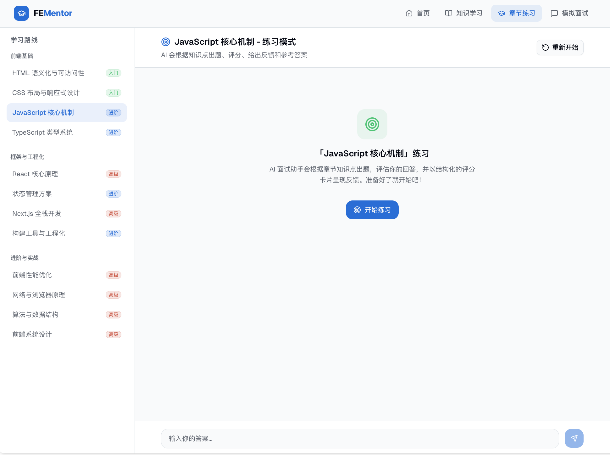

# fementor

> 当前项目尚未开发完成，README 中展示的能力包含已实现部分与正在推进中的设计方向。

FEMentor 是一个面向前端求职场景的 AI 面试训练系统，围绕“简历解析、岗位理解、模拟面试、检索增强评分、长期记忆沉淀”构建完整训练闭环。

项目当前采用前后端分离架构：

- 前端基于 `Next.js`
- 后端基于 `Node.js`
- 数据层使用本地 `SQLite`
- 检索链路接入 `Sirchmunk`
- 对话与评分链路接入 OpenAI 兼容模型与 SSE 流式输出

核心目标不是单次问答，而是把候选人的简历、JD、项目经历、练习记录和面试反馈串起来，形成一套可持续迭代的训练过程。

## 项目截图




## 核心能力

- 简历 / JD 上传与解析，生成候选人画像与岗位理解摘要
- 模拟面试逐轮出题、逐轮评分，并支持 SSE 流式反馈
- 本地文档优先的检索增强链路，用于回答 grounding、评分辅助与追问生成
- 练习记录、优缺点、薄弱点与长期记忆沉淀
- 对话式训练体验，支持从题目练习扩展到项目复盘与知识点追问

## 当前目标

- 支持用户上传文档（简历 / 学习笔记 / 项目文档）
- 本地检索优先（Sirchmunk / rga），证据不足时再 WebSearch
- 对练习与模拟面试进行评分，沉淀用户薄弱项和优缺点
- 使用 Markdown + 结构化数据做可追溯 memory
- 支持对话式 LLM 与 SSE 流式输出

## 项目结构

- `apps/api`：后端 API（MVP 骨架）
- `apps/web`：Next.js 前端
- `docs`：需求、架构、API、DB、迭代日志
- `data/user_docs`：用户上传文档（本地）
- `data/memory`：用户 Markdown memory

## 启动

```bash
npm install
npm run dev
```

默认会同时启动：

- API：`http://localhost:3300`
- Web：`http://localhost:3000`

如需单独启动：

```bash
npm run dev:api
npm run dev:web
```

页面入口：

- `/`：总览
- `/resume`：简历解析
- `/interview`：模拟面试会话
- `/bank`：题单管理
- `/practice`：章节练习拉题

## 主要页面

### 简历解析

- 上传 PDF / DOCX 简历
- 解析正文并生成简历摘要
- 管理已上传简历与激活态

### 模拟面试

- 基于简历和 JD 生成题目
- 支持逐轮回答、逐轮评分、追问与反馈
- 支持 SSE 流式阶段信息与最终结果

### 题库与练习

- 支持章节练习和题单式训练
- 为后续“知识点块级训练 + 画像更新”提供基础数据

## 当前数据库

- 本地 SQLite：`data/fementor.db`

## LLM 配置（可选）

后端会自动读取 `apps/api/.env`。

- `OPENAI_BASE_URL`（默认 `https://api.openai.com/v1`）
- `OPENAI_API_KEY`
- `OPENAI_MODEL`（默认 `gpt-4o-mini`）

未配置 `OPENAI_API_KEY` 时，聊天接口自动返回 mock 文本/流，便于前后端联调。

当前已经接入 LLM 的链路：

- `/v1/resume/parse`：优先使用 LLM 生成简历摘要，失败时回退规则摘要
- `/v1/scoring/evaluate`：分数仍走规则评分，优点/缺点/反馈优先使用 LLM 重写
- `/v1/chat/sessions/*`：对话与 SSE 流式输出

## 检索策略（当前）

1. `POST /v1/retrieval/search` 为统一入口。
2. 后端通过统一检索适配层输出 `query_plan / evidence_refs / strategy / need_fallback`。
3. 默认 `strategy=auto`：直接走 `sirchmunk`，不再自动触发本地 `rg`。
4. 本地 `rg` 仅保留为显式 `strategy=local` 的调试入口。
5. 若 `sirchmunk` 证据不足，则返回 `web_fallback`（默认关闭，设置 `ENABLE_WEBSEARCH=1` 开启占位模式）。

当前上层业务只依赖统一返回结构，不依赖 `sirchmunk` 的 `FAST/DEEP/primary/fallback` 等内部概念。

可选的 `sirchmunk` 环境变量：

- `SIRCHMUNK_BIN`：命令路径，默认 `sirchmunk`
- `SIRCHMUNK_MODE`：搜索模式，默认 `FAST`

可通过 `GET /health` 查看当前 `llm` 与 `sirchmunk` 状态。

## 当前演进方向

- 从“整场静态出题”演进到“逐题生成 + 逐题检索规划”
- 从简单上下文堆叠演进到“短期记忆 + 长期画像 + 块级 compact”
- 从规则摘要演进到更稳定的题目级 retrieval query 与证据型评分链路
